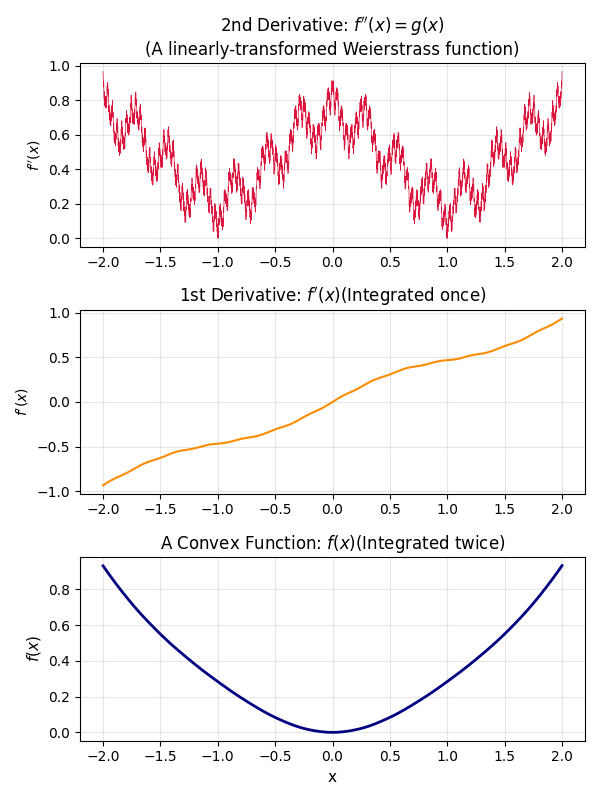
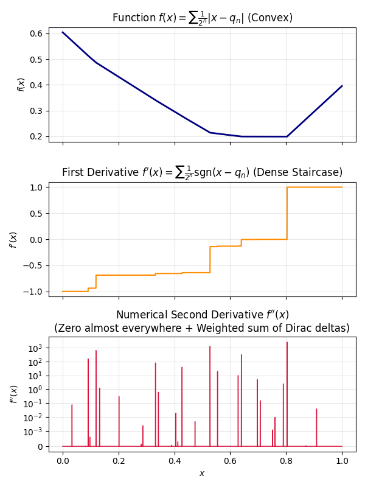

# Convex Function Differentiability

This repository explores how many times a convex function can be differentiated,
including classical results (continuity, differentiability a.e.) and constructive
counterexamples. The explanations and plots live in the notebook.

## Contents

- `cvx_nth_diff.ipynb`: Main notebook with notes, references, and visualizations.

<table>
	<tr>
		<td></td>
		<td></td>
	</tr>
</table>

## Requirements

- Python 3.10+ (recommended)
- `numpy`
- `matplotlib`
- `scipy`
- `ipykernel` (for running the notebook)

```bash
conda create -n convex-diff python=3.10 -y
conda activate convex-diff
python -m pip install -e .
```

## Quick Start

1. Create and activate a virtual environment.
2. Install dependencies (from `pyproject.toml`).
3. Open the notebook and run all cells.

## Notes

Generated figures are saved in the project directory when you run the notebook.
